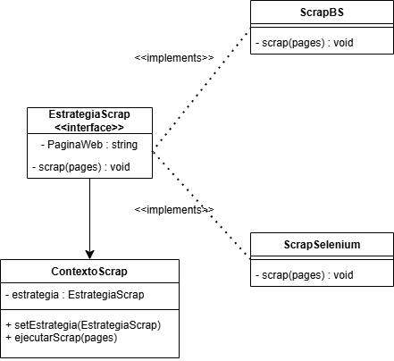

# Practicas DS
### Por Ana Cascone Hernández, Vicente Martínez Pastor y Manuel Martínez Cobos
---
## Relación 1
### Ejercicio 3
Implementar un programa en Python que, utilizando el patrón de diseño Strategy, obtenga información de las 5 primeras páginas del sitio web de prueba **https://www.scrapethissite.com/pages/forms/**. Se deben extraer los siguientes datos estad´ısticos de cada equipo de hockey:

* Nombre del equipo (Team Name).
* Año (Year ).
* Victorias (Wins).
* Derrotas (Losses).
* Derrotas en tiempo extra (OT Losses).
* Porcentaje de victorias (Win % ).
* Goles a favor (Goals For ).
* Goles en contra (Goals Against).
* Diferencia de goles (+ / -).
  
La información extraída se debe guardar en un archivo **CSV**. El programa debe solicitar al usuario en tiempo de ejecución qué estrategia desea emplear, debiendo implementar obligatoriamente las siguientes dos:

* **BeautifulSoup**: Empleando requests y BeautifulSoup para obtener y parsear el HTML estático.
* **Selenium**: Utilizando Selenium WebDriver para acceder al navegador (en modo headless), procesar el HTML y extraer los elementos del DOM

#### *Diagrama UML de la solución propuesta*

