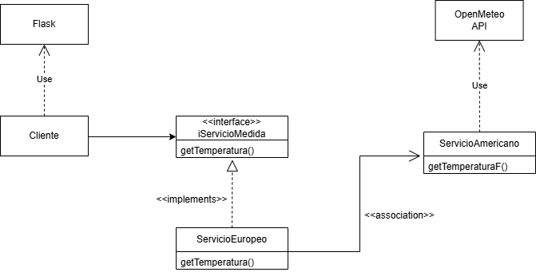

# Practicas DS
### Por Ana Cascone Hernández, Vicente Martínez Pastor y Manuel Martínez Cobos
---
## Relación 1
### Ejercicio 3
Implementar un programa en Python que, utilizando el patrón de diseño Strategy, obtenga información de las 5 primeras páginas del sitio web de prueba **https://www.scrapethissite.com/pages/forms/**. Se deben extraer los siguientes datos estad´ısticos de cada equipo de hockey:

* Nombre del equipo (Team Name).
* Año (Year ).
* Victorias (Wins).
* Derrotas (Losses).
* Derrotas en tiempo extra (OT Losses).
* Porcentaje de victorias (Win % ).
* Goles a favor (Goals For ).
* Goles en contra (Goals Against).
* Diferencia de goles (+ / -).
  
La información extraída se debe guardar en un archivo **CSV**. El programa debe solicitar al usuario en tiempo de ejecución qué estrategia desea emplear, debiendo implementar obligatoriamente las siguientes dos:

* **BeautifulSoup**: Empleando requests y BeautifulSoup para obtener y parsear el HTML estático.
* **Selenium**: Utilizando Selenium WebDriver para acceder al navegador (en modo headless), procesar el HTML y extraer los elementos del DOM

#### *Diagrama UML de la solución propuesta*

### Ejercicio 4
Un servicio de autenticación requiere validar las credenciales de un usuario (correo y contraseña) sin modificar las clases existentes. Para ello, se debe implementar una solución aplicando el patrón de filtros de intercepción (Intercepting Filter ).

1. Solicitar al usuario que introduzca un correo y una contraseña.
2. Implementar dos filtros independientes para la validación del correo:
  * Un filtro que verifique que el correo contenga texto antes del carácter @.
  * Un filtro que verifique que el dominio sea gmail.com o hotmail.com.
3. Implementar tres filtros independientes para la contraseña. Los criterios de estos filtros serán definidos por el grupo de trabajo, pero cada uno debe comprobar una regla distinta que contribuya a mejorar la seguridad (ej. longitud m´ınima, uso de caracteres especiales, etc.).
4. Cada comprobación debe hacerse en su propio filtro, y cada filtro debe implementarse en una clase separada.
5. Utilizar el patrón de filtros de intercepción para encadenar y ejecutar estas validaciones antes del procesamiento final de la autenticación.
6. La solución debe implementarse obligatoriamente en el lenguaje de programación Ruby.

#### *Diagrama UML de la solución propuesta*

### Ejercicio 5
Un sistema de domótica (Smart Home) centralizado en Europa procesa, registra y muestra la temperatura de las instalaciones utilizando grados Celsius. Recientemente, la empresa ha adquirido un nuevo lote de sensores meteorológicos de alta precisión importados de Estados Unidos, los cuales transmiten sus lecturas exclusivamente en grados Fahrenheit. El panel de control europeo necesita estas temperaturas en Celsius para activar correctamente las alarmas y el sistema de  climatización.

Objetivo del ejercicio: Implementar una solución que permita al panel central europeo leer, interpretar y utilizar las mediciones provistas por los nuevos sensores estadounidenses.

Utilizar un patrón de diseño estudiado. El código debe permitir que el sistema europeo consuma la información de los sensores estadounidenses sin modificar las clases existentes (ni la del panel central ni la de los sensores).

El lenguaje de programación es libre. Criterios de puntuación:
* Realización del ejercicio usando el patrón de diseño adecuado. (Hasta 0.8 puntos).
* Uso de sockets, interfaz gráfica, y/o otras librerías donde se simule el software en un entorno real (Hasta 1.2 puntos, pero se requiere defensa de las librerías externas utilizadas).
* 
Se evaluarán todos los elementos de un diseño de software adecuado.

#### Solución Manu

